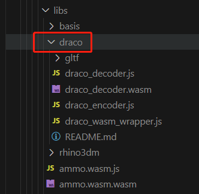
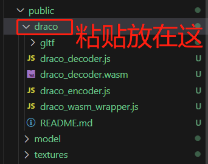

# Vue 3 + TypeScript + Vite

This template should help get you started developing with Vue 3 and TypeScript in Vite. The template uses Vue 3 `<script setup>` SFCs, check out the [script setup docs](https://v3.vuejs.org/api/sfc-script-setup.html#sfc-script-setup) to learn more.

## Recommended IDE Setup

- [VS Code](https://code.visualstudio.com/) + [Volar](https://marketplace.visualstudio.com/items?itemName=Vue.volar)

## Type Support For `.vue` Imports in TS

Since TypeScript cannot handle type information for `.vue` imports, they are shimmed to be a generic Vue component type by default. In most cases this is fine if you don't really care about component prop types outside of templates. However, if you wish to get actual prop types in `.vue` imports (for example to get props validation when using manual `h(...)` calls), you can enable Volar's Take Over mode by following these steps:

1. Run `Extensions: Show Built-in Extensions` from VS Code's command palette, look for `TypeScript and JavaScript Language Features`, then right click and select `Disable (Workspace)`. By default, Take Over mode will enable itself if the default TypeScript extension is disabled.
2. Reload the VS Code window by running `Developer: Reload Window` from the command palette.

You can learn more about Take Over mode [here](https://github.com/johnsoncodehk/volar/discussions/471).

## 安装

安装[three.js](https://threejs.org/)、补件动画库[gsap](https://greensock.com/get-started/#tweening-basics)

```
yarn add three gsap
```
安装对应的 .d.ts 文件包 给ts做代码提示用的 如果没有ts可以选择跳过 
```
yarn add @types/three
```

## 遇到的问题
1、使用GLTFLoader、DRACOLoader时候,报错如下：
```
THREE.DRACOLoader: Unexpected geometry type.
```

原因：

导致这个报错有两种可能，需要逐一排除：
- 可能性一：THREE.DRACOLoader.setDecoderPath('url')中设置的draco解压器之url路径不正确。
- 可能性二：draco解压器路径正确但版本与当前Three.js不匹配。

解决方案：
- 对于可能性一，请修正draco的url。
- 对于可能性二，请引入版本相符的draco。
  
以vite脚手架为例 node_modules\three\examples\jsm\libs\ 下的darco文件夹拷贝到 public\ 下，之后报错就解决了。




## 项目查找
- 宝马4s汽车展示与选配应用： Car.vue
- 圣诞节爱心3D贺卡： ChristmasLoveCard.vue
- 酷炫球形机器人展示：
- 全景看房项目代码view360：
- 水晶3D小熊：
- 酷炫3D官网：
- 酷炫3D地球：
- 酷炫3D字体：
- 世界杯点球小游戏：
- 酷炫3D导弹飞行演示：
- 水天一色小岛：